# Widget gallery

These are element-level screenshots from the Hydrogen example, captured in Brave on 2026-07-14. Each image contains one `judgeme-react` component and nothing from the surrounding product page.

The store's public Judge.me settings are in effect, including its dark navy primary color, labels, locale, branding, and star treatment. Layout choices that normally belong to a Shopify theme block come from the example's typed component config.

Two screenshots need a qualifier:

- Questions & Answers uses Judge.me's visibly labeled, read-only `sample_data` preview because the fixture store has Q&A disabled and no published questions.
- UGC Media Grid uses a documentation-only post fixture rendered through Judge.me's real current grid runtime because the fixture store has no published Instagram posts.

Videos Carousel is shown in photo/video selection mode. The fixture still has no published video review, so the image proves the media-card layout rather than iframe playback.

## Product review surfaces

### Star Rating Badge

Compact product rating for a title, buy box, or product card.

### Review Widget v3

Judge.me's current Shopify Review Widget, including its dashboard treatment, filters, product/store tabs, review cards, and Write a review flow.

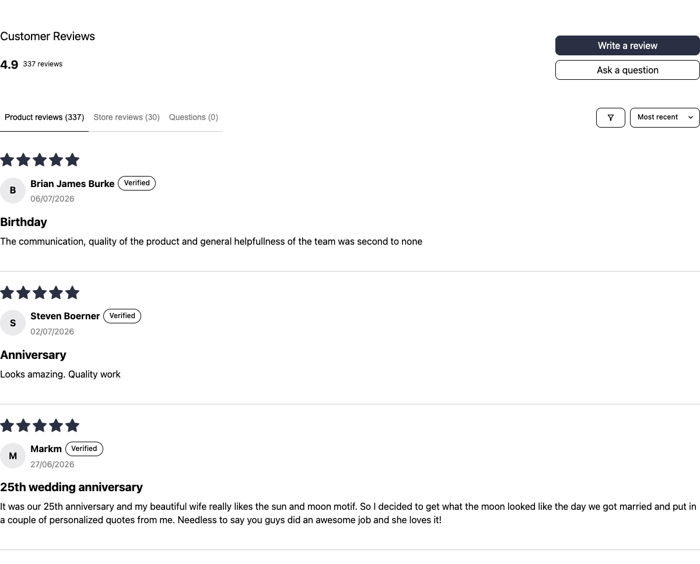

### Legacy Review Widget

The public platform-independent Review Widget and fallback for stores that do not return the v3 feed.

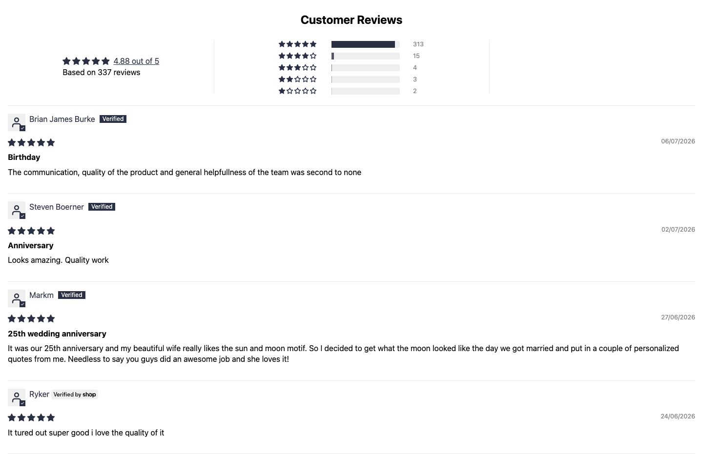

### Questions & Answers

The independently placeable React Q&A surface. This capture is Judge.me's read-only sample preview, clearly labeled inside the component.

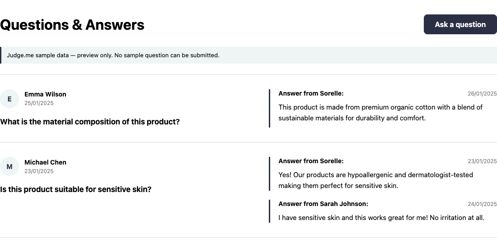

## Store-wide reviews and trust

### Happy Customers

Judge.me's current All Reviews v2025 experience with review streams, histogram, filters, sorting, and pagination.

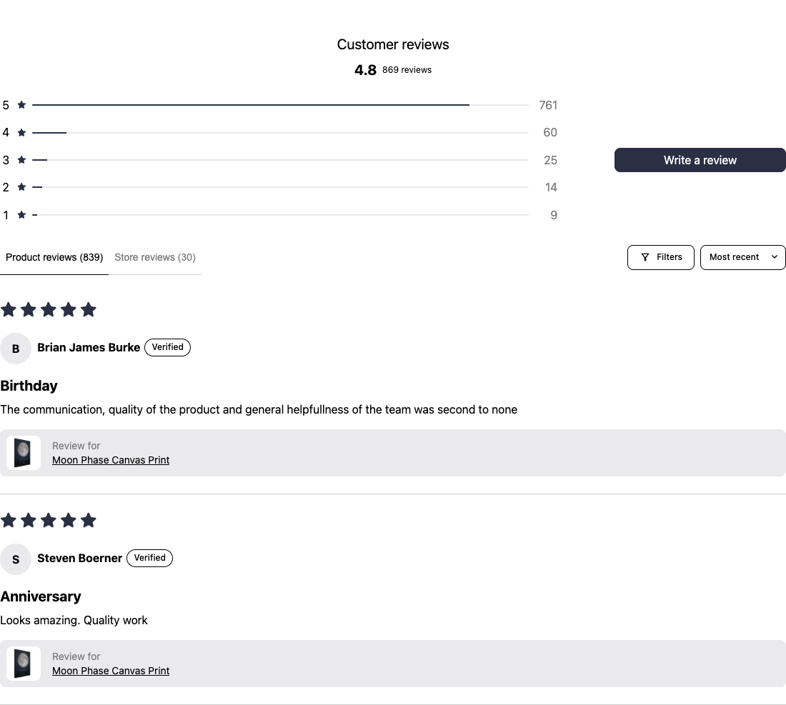

### All Reviews Widget

The platform-independent All Reviews surface with product/shop streams and React-owned navigation.

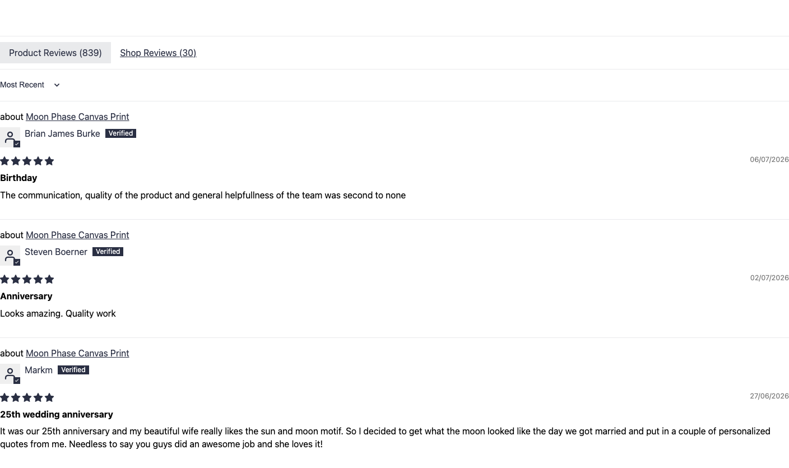

### All Reviews Counter

Combined store rating and count with the merchant's branded dashboard treatment.

### Verified Reviews Counter

Judge.me's exact branded verified-review badge. Judge.me returns this only after the store reaches its verified-review threshold.

### Judge.me Medals

Every medal currently earned by the fixture store, plus Judge.me's verified-review summary.

### Trust Badge

The compact Trust Badge. Selecting it opens Judge.me's verified-review modal.

### AI Reviews Summary

Judge.me's generated shop summary, sourced from its Shopify metafield and rendered by the current extension module.

## Carousels and visual proof

### Cards Carousel

The current visual review-card carousel and media lightbox surface.

### Testimonials Carousel

One-at-a-time quote cards with React-owned arrows and autoplay lifecycle.

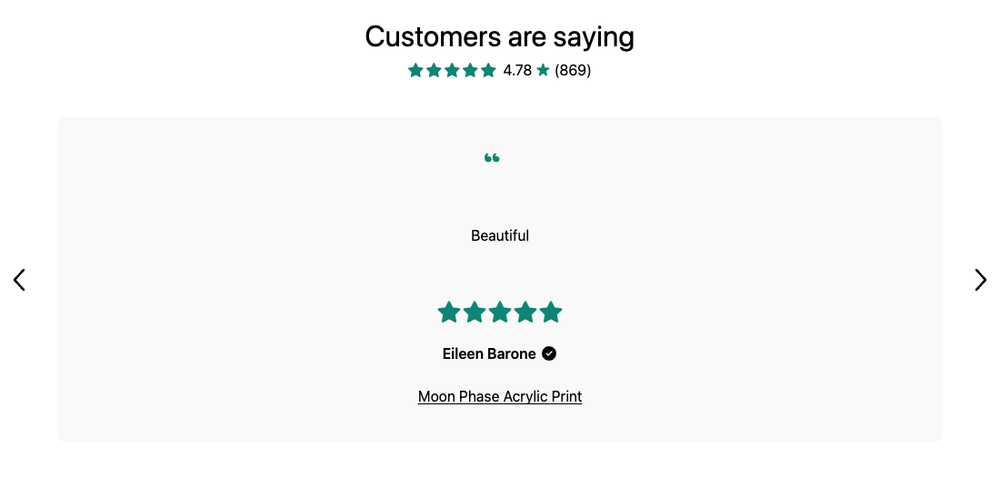

### Videos Carousel

The current media carousel in photo/video selection mode. The fixture has photo cards but no published video playback case.

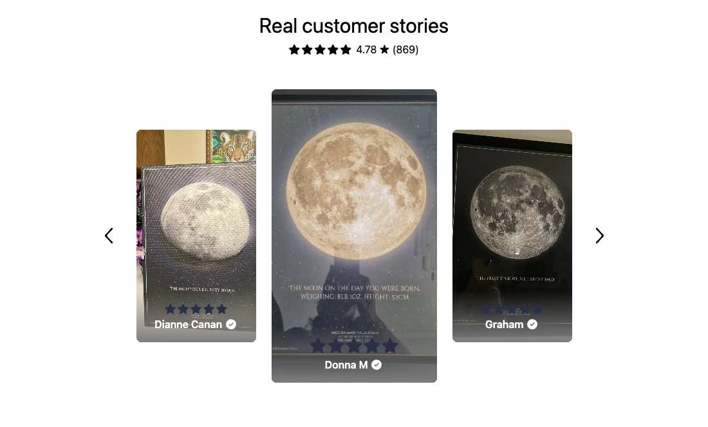

### Classic Reviews Carousel

Judge.me's older fixed-height Reviews Carousel, preserved for storefronts that use its classic design.

### Review Snippets

The compact rotating product/cart review strip.

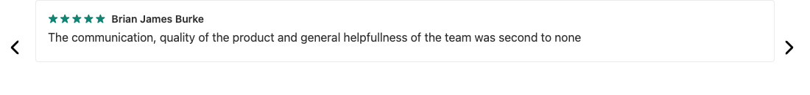

### Reviews Grid

Judge.me's current extension-driven review/media grid.

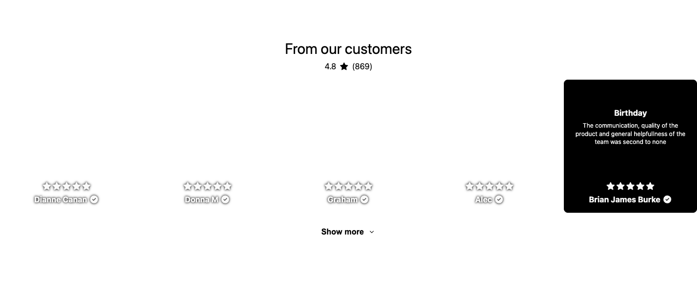

### UGC Media Grid

The current Instagram shopping grid rendered through Judge.me's real browser runtime. This is a documentation fixture because the live store has no published UGC posts.

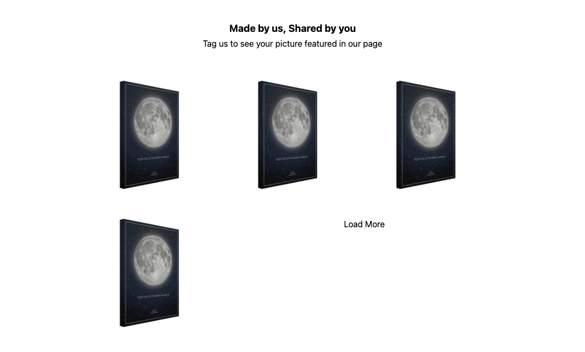

## Global overlays

### Floating Reviews Tab

The open global drawer returned by Judge.me's exact `reviews_tab` path. Stores without the paid endpoint can use the package's public All Reviews fallback.

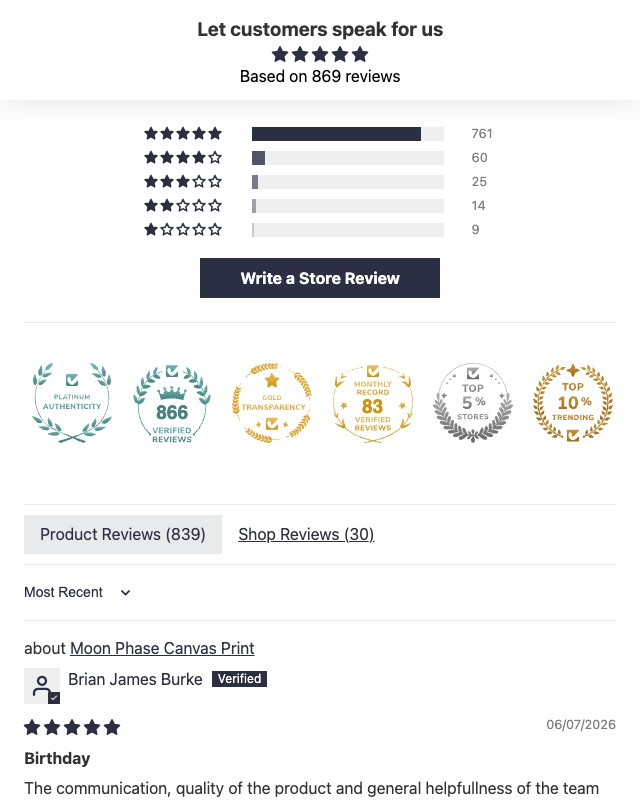

### Pop-up Reviews

The native React compatibility version of Judge.me's timed review notification.

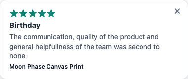

## What the screenshots do not prove

The gallery shows layout and current fixture data. It does not replace runtime verification. A production integration should still test forms, sorting, pagination, SPA remounts, lightboxes, media playback, and the host's Content Security Policy against the merchant's own enabled features.
