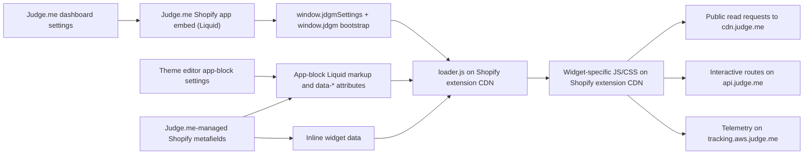

# Judge.me on Shopify: runtime and Hydrogen feasibility

Date: 2026-07-13
Store inspected: `vanilla-slop.myshopify.com`
Pages inspected: `/products/wall-art-poster` and `/`
Browser: Brave, using the storefront preview, Shopify theme editor, DevTools DOM, console, and network panels

> Strategy update: this was the initial conservative feasibility pass. The project now explicitly prioritizes full widget coverage and permits a merchant-controlled v3 compatibility layer, dynamic asset discovery, undocumented contract research, and public/private API use. See [Judge.me widget coverage, official Hydrogen package, and all-widget workarounds](judgeme-widget-coverage-and-workarounds-2026-07-13.md) for the current implementation direction.

## Executive answer

The idea is viable in a narrower form, but a supported, configuration-complete React port of **every current Judge.me widget** is not available from the Shopify theme integration alone.

There are two materially different paths:

1. **Supported path:** Judge.me now offers “platform-independent widgets” for Shopify-backed storefronts hosted elsewhere. This is the natural first Hydrogen experiment because Judge.me supplies a per-store script and the widgets continue to use Judge.me's rendering/configuration system. It is an Awesome-plan feature and currently supports nine widgets, including only the **legacy** Review Widget—not the new v3 Review Widget.
2. **Reverse-engineered path:** The Shopify app embed can be mirrored by recreating its global settings, marker DOM, extension loader, and data calls. The public CDN reads work from a browser today, but this depends on undocumented endpoints, versioned Shopify extension assets, and Liquid-generated data. It would be brittle, incomplete for write interactions, and potentially inconsistent with Judge.me's terms unless Judge.me explicitly approves it.

The recommended next step is therefore a small React wrapper around Judge.me's official platform-independent script, not a fresh renderer and not a store-page scraper. If it cannot meet the required widget/version coverage, get a written answer from Judge.me about headless v3 support before investing in a full compatibility layer.

## What Shopify is doing



Shopify's model matches the observed page:

- The **app embed** supplies the shared runtime and store-level configuration.
- Each **app block** supplies its placement, product/shop context, and block-specific settings.
- Judge.me-managed **Shopify metafields** can supply pre-rendered legacy HTML and cached JSON.
- A small loader discovers `.jdgm-widget[data-entry-point]` elements and code-splits the appropriate JS and CSS.

Shopify documents app blocks, app embeds, their Liquid scopes, and extension assets hosted on Shopify's CDN in [Configure theme app extensions](https://shopify.dev/docs/apps/build/online-store/theme-app-extensions/configuration). Judge.me's own [Liquid widget examples](https://judge.me/help/en/articles/12058208-liquid-code-for-judge-me-widgets) confirm its dependency on `product.metafields.judgeme.*`, `shop.metafields.judgeme.*`, marker classes, and entry-point attributes.

Hydrogen does not execute Online Store Liquid or theme app extensions. It therefore does not automatically receive the app embed, app-block markup, inline `jdgmSettings`, or all of the Judge.me metafield-derived payloads.

## Storefront observations

### Shared bootstrap

The enabled app embed emitted:

- `window.jdgmSettings`, an inline object containing 657 fields in this snapshot. It covered widget themes, colors, copy, form behavior, pagination, locale, review filters, empty states, and feature flags.
- `window.jdgm`, also aliased as `window.judgeme`.
- Runtime hosts including:
  - `CDN_HOST = https://cdnwidget.judge.me/`
  - `CDN_HOST_ALT = https://cdn2.judge.me/cdn/widget_frontend/`
  - `CDN_API_HOST = https://cdn.judge.me/`
  - `API_HOST = https://api.judge.me`
  - `WIDGET_TRACKING_API_HOST = https://tracking.aws.judge.me`
- `isVersion3 = true` and a deployment-specific `CDN_BASE_URL` on Shopify's extension CDN.

The inspected extension asset base was:

```text
https://cdn.shopify.com/extensions/019f4c84-84df-7501-b4cf-3f7b2005bf6e/judgeme-624/assets/
```

This URL is evidence from the dated snapshot, not an integration contract. The UUID/version segment can change when Judge.me deploys a new extension version.

The loader found widget marker elements, flattened logical entry paths into extension asset names, loaded a manifest plus widget-specific CSS/JS, and selected legacy or v3 behavior from settings, inline data, and legacy markup.

### Product page blocks

The product page contained 12 Judge.me app-block wrappers for Shopify product ID `15151876309375`.

| Theme block | Live zero-review result | Important runtime input |
| --- | --- | --- |
| Cards Carousel | Hidden | `data-widget="cards-carousel"`; carousel CDN request |
| Instagram/UGC Media Grid | Empty | `.jdgm-ugc-media-wrapper` |
| Review Widget | Visible empty state: “Be the first to write a review” | Product ID/title, shop aggregate, `data-entry-point="review_widget.js"` |
| Reviews Carousel - Legacy | Empty | Legacy carousel wrapper/metafield path |
| Reviews Grid | “No items found” | Inline grid data plus extensive block `data-*` configuration |
| Reviews Text | Visible aggregate with zero reviews | Shop rating/count |
| Section for Medals | Empty | Judge.me shop-level content |
| Star Ratings | Hydrated, then hidden | Product ID and empty-state setting |
| Testimonials Carousel | Hidden | Carousel CDN request |
| Trust Badge | Empty | Store setting was disabled |
| Verified Reviews Badge | Empty | Judge.me shop-level content |
| Videos Carousel | Hidden | Carousel CDN request |

The theme editor displayed sample content for several empty widgets while the storefront did not. That is expected: Judge.me documents that sample Review Widget reviews appear only inside the Shopify theme editor in [Adding the Review Widget on your product page](https://judge.me/help/en/articles/11424925-adding-the-review-widget-on-your-product-page).

### Homepage manual star rating

The homepage's manual installation produced this core marker:

```html
<div
  class="jdgm-widget jdgm-preview-badge jdgm--done-setup"
  data-id="15151876309375"
  data-template="manual-installation"
  data-widget-name="preview_badge"
  style="display: none;"
>
  <!-- hydrated badge with data-average-rating="0.00" and data-number-of-reviews="0" -->
</div>
```

The shared app-embed runtime hydrated five inactive stars and “No reviews,” then hid the outer marker because the store has no reviews and `hide_badge_preview_if_no_reviews` was enabled. The manual badge is therefore not standalone; it depends on the same global bootstrap as the app blocks.

## Observed network and data contracts

These are dated implementation observations, not documented public contracts.

| Purpose | Observed host/path | Result in this store |
| --- | --- | --- |
| Review Widget page data | `GET https://cdn.judge.me/reviews/reviews_for_widget` | Product identity, rating histogram, reviews, pagination, cached update timestamp |
| Carousel data | `GET https://cdn.judge.me/reviews/reviews_for_carousel` | Empty `reviews` array for cards, testimonials, and videos |
| Reviews Grid data | `GET https://cdn.judge.me/widgets/reviews_grid_widget_data` | Empty review selection/count |
| Widget telemetry | `https://tracking.aws.judge.me/widgets/track_bulk_events` | One batched request with eight events in the inspected load |
| Extension JS/CSS | `https://cdn.shopify.com/extensions/.../judgeme-624/assets/*` | Loader, widget entry chunks, manifests, CSS, icons, and fonts |

The three inspected `cdn.judge.me` JSON reads returned HTTP 200 with `Access-Control-Allow-Origin: *` and a public cache lifetime of 1,200 seconds. Their `Link: rel="canonical"` headers pointed at equivalent `api.judge.me` URLs. In other words, “using the CDN instead of the API” avoids an API token and uses Judge.me's cache edge, but it is still an API-shaped data service behind the CDN.

The downloaded widget bundle also showed that interactive behavior does not remain CDN-only:

- review pagination/filter/search reads can use the CDN cache;
- review voting posts to an API `thumbs` route;
- questions use API question routes;
- the review form opens an `api.judge.me/storefront_reviews/new` flow.

A library that supports the complete widget behavior therefore cannot honestly promise “no Judge.me API traffic.” It can promise **no private API token** and **no direct use of the documented token API** if it delegates interaction to Judge.me's own widget runtime.

## Where configuration comes from

There are three distinct configuration layers:

1. **Judge.me dashboard configuration** becomes the large inline `window.jdgmSettings` object emitted by the app embed. This contains store-wide colors, copy, layouts, feature flags, review-form settings, locales, and empty-state behavior.
2. **Shopify theme-editor block configuration** becomes `data-*` attributes and block-local inline objects. The Reviews Grid and carousel blocks demonstrated this directly.
3. **Review/product/shop data** comes from Judge.me's public CDN reads and Judge.me-managed Shopify metafields. The official Liquid examples use fields such as `product.metafields.judgeme.review_widget_data`, `product.metafields.judgeme.badge`, `shop.metafields.judgeme.all_reviews_count`, and `shop.metafields.judgeme.featured_carousel`.

Fetching only CDN review JSON is therefore insufficient for dashboard-perfect rendering. The CDN responses provide review data, but the app embed is the observed source of the full styling/copy/behavior configuration.

We have not yet established that every Judge.me metafield used by Liquid is exposed to the Storefront API. That must be tested explicitly before designing a Hydrogen data adapter around those metafields.

## Official headless option

Judge.me's [Platform-independent widgets](https://judge.me/help/en/articles/8394958-platform-independent-widgets) documentation is directly applicable to a Shopify-backed Hydrogen storefront.

Current documented constraints:

- requires Judge.me's Awesome plan;
- must be enabled under Judge.me **Settings > Advanced**;
- Judge.me supplies a store-specific script to place before `</head>`;
- supports Star Rating Badge, legacy Review Widget, Reviews Carousel, Floating Reviews Tab, All Reviews Widget, Verified Reviews Counter, Judge.me Medals, UGC Media Grid, and All Reviews Counter;
- does **not** support the new Review Widget; Judge.me says to switch back to legacy for an external page.

This path is the closest match to the requested behavior: a React library can provide typed marker components and a provider that loads the official script once, while Judge.me continues to own data fetching and dashboard styling.

It does not currently cover every block on the test product page. Notably, the documented list does not include the new Review Widget, Cards/Testimonials/Videos carousels, Reviews Grid, Review Snippets, or newer AI widgets.

## Feasibility by approach

| Approach | Dashboard configuration | Widget coverage | Stability | Recommendation |
| --- | --- | --- | --- | --- |
| Wrap official platform-independent script | Preserved by Judge.me | Nine documented widgets; legacy Review Widget | Supported, but paid and version-limited | **Start here** |
| Wrap Shopify v3 extension runtime in client-only React markers | Potentially high if the complete bootstrap can be supplied | Potentially close to Shopify coverage | Undocumented and deployment-coupled | Research only after Judge.me approval |
| Rebuild widgets in React from `cdn.judge.me` JSON | Must be reverse-engineered/recreated | Reads are feasible; interactions and new features diverge | Internal endpoint and schema risk | Poor fit for configuration parity |
| Scrape the Online Store HTML to extract `jdgmSettings` | High snapshot fidelity | Depends on the current page/bootstrap | Fragile, slow, unsafe to evaluate, and terms-sensitive | Do not ship |
| Use Judge.me's documented Widget API | Data access is supported; UI configuration must be recreated | Custom UI, not native widget parity | Most stable data contract | Fallback if the “no API” constraint changes |

Judge.me documents a public API token specifically for GET requests to its Widget API in [Using Judge.me API](https://judge.me/help/en/articles/8409180-using-judge-me-api). That is a more supportable custom-React data source than undocumented CDN routes, but it does not satisfy the current preference and would not automatically reproduce dashboard UI settings.

## Terms, maintenance, and security risks

- Judge.me's current [Terms](https://judge.me/terms) contain an express prohibition on automated text/data mining and web scraping. A production service that repeatedly scrapes the Shopify-rendered Judge.me bootstrap should not be built without written permission and legal review.
- Extension JS/CSS is Judge.me's copyrighted implementation and is served from a versioned Shopify CDN path. Repackaging or modifying it is different from loading Judge.me's supported script.
- CORS headers, CDN routes, JSON shapes, query parameters, and globals can change without semver or notice.
- Evaluating an extracted inline script would create an injection boundary. If a future experiment parses the bootstrap, it should parse a narrowly validated object rather than execute scraped JavaScript.
- Widget telemetry and review interactions have privacy/consent implications. Judge.me should remain listed as the review provider/sub-processor as required by its terms and privacy guidance.
- Empty stores hide many components. Compatibility tests need seeded product, store, photo, video, verified, and question data—not only theme-editor samples.

## Recommended spike

Do not scaffold the final npm API yet. First prove the supported integration with two components:

1. In Judge.me admin, inspect **Settings > Advanced > Platform-independent Review Widget** and capture the generated script without committing any private token.
2. Add a client-only `JudgeMeProvider` that loads that script exactly once and reports load/error state.
3. Add typed `StarRatingBadge` and `LegacyReviewWidget` marker components.
4. Mount them in a minimal Hydrogen route using Shopify's numeric product ID.
5. Change one color and one text setting in Judge.me, then verify the Hydrogen output updates without a library release.
6. Seed at least one real test review and verify empty/non-empty transitions, navigation, form opening, CSP, hydration, and cleanup across React route changes.
7. Ask Judge.me support whether the v3 Review Widget and the missing carousel/grid widgets have a supported external-storefront bootstrap or roadmap.

Only after that spike should the package API be frozen. A likely architecture would be a provider plus small declarative marker components, not React reimplementations of Judge.me's UI.

## Evidence status

- Live behavior and endpoint details above are observations from 2026-07-13 and should be rechecked before implementation.
- This report is linked as the ctx notes resource `judgeme-runtime-research-2026-07-13`.
- Official Judge.me and Shopify pages are pinned in `.ctx/ctx.json` so future agents can query the same source set with `ctx query`.
- No secrets, API tokens, customer data, or full third-party bundles were stored in this repository.
