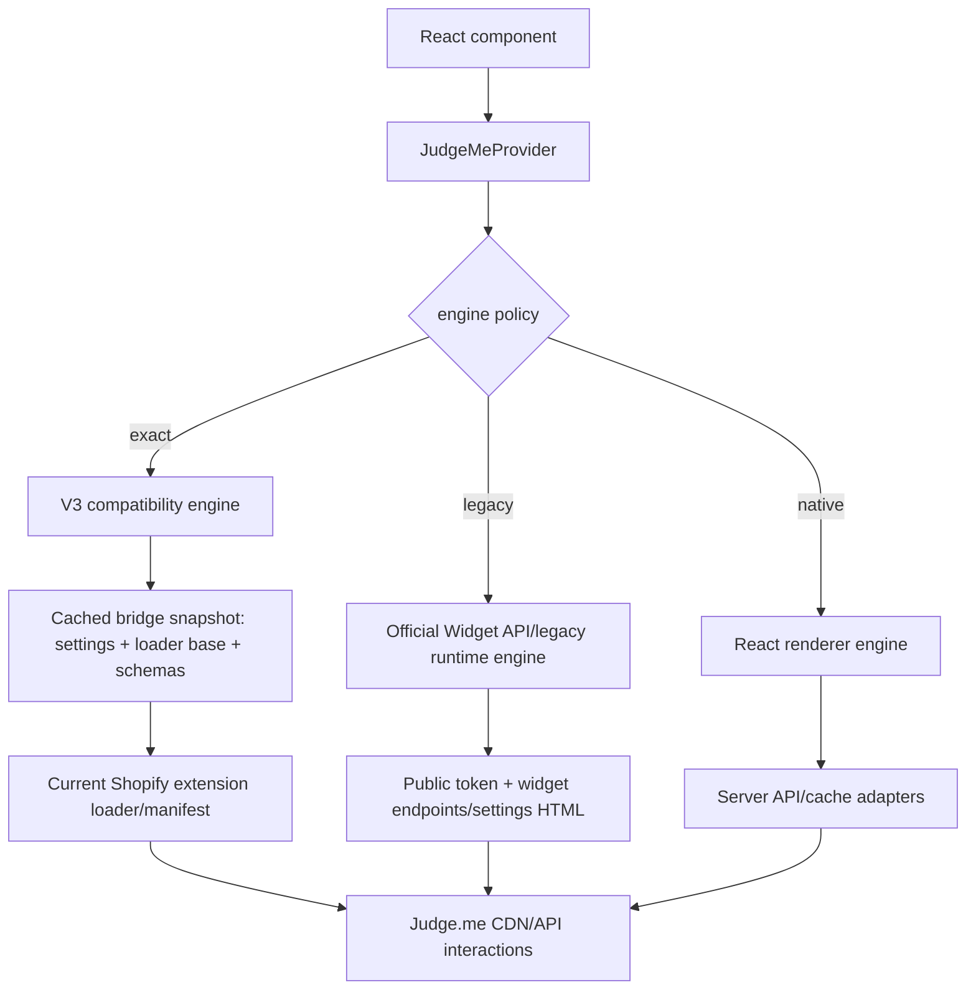

# Judge.me widget coverage, official Hydrogen package, and all-widget workarounds

Date: 2026-07-13
Scope: current Judge.me Shopify widgets, platform-independent support, the official Hydrogen package, public/private API options, and a compatibility design that prioritizes full coverage

## Bottom line

Supporting every current **storefront** widget in Hydrogen looks technically possible, but not through Judge.me's documented headless integration alone.

The practical design is a hybrid with two engines:

1. **Exact engine:** discover and load Judge.me's current Shopify v3 extension runtime, reproduce the app-embed globals and widget marker DOM, and let Judge.me render and operate the widget. This is the only route likely to preserve new-widget behavior and Judge.me dashboard/theme-block configuration without rebuilding every setting.
2. **Native engine:** use the documented Widget API, public cache endpoints, and typed React renderers for SSR, graceful degradation, testing, and eventual independence. The public token can be shipped to the browser for Widget API GETs; the private token must stay server-side.

This is feasible engineering, not a supported contract. The v3 bridge depends on undocumented runtime details, versioned Shopify extension assets, and a configuration bootstrap normally generated by Liquid. It therefore needs an asset/config discovery service, schema snapshots, canaries, and last-known-good rollback.

## What “unsupported” means

Judge.me documents nine platform-independent widgets:

- Star Rating Badge
- Review Widget, **legacy version only**
- Reviews Carousel, meaning the classic/original carousel
- Floating Reviews Tab
- All Reviews Widget, meaning the legacy Happy Customers experience
- Verified Reviews Counter
- Judge.me Medals
- UGC Media Grid, also called the UGC Instagram Shopping Widget
- All Reviews Counter, also called Reviews Text

“Unsupported” below means absent from that documented non-Shopify-page list. It does not necessarily mean Judge.me calls every item “v3.” Judge.me explicitly distinguishes new/legacy versions for the Review Widget and Happy Customers Widget; several other unsupported widgets are simply Shopify 2.0 app blocks or embeds.

## Unsupported storefront matrix

There are 11 current storefront variants/features not covered by the documented platform-independent mode.

| Unsupported variant or widget | Why it is outside the official headless path | Best exact-parity workaround | Native/API fallback |
| --- | --- | --- | --- |
| Review Widget, new version | Judge.me explicitly says platform-independent mode supports legacy only | Emit its v3 `review_widget.js` marker/data contract, provide the current `jdgmSettings`, and load the Shopify extension runtime | Render review JSON natively; delegate write-review, media upload, votes, and questions to Judge.me-hosted/runtime flows |
| Happy Customers Widget, new version | “All Reviews Widget” is supported, but Judge.me documents distinct new and legacy Happy Customers versions | Recreate the v3 all-reviews marker and bootstrap | Combine product/store review data in a native tabbed renderer; use Judge.me's form for store-review submission |
| Cards Carousel | Shopify 2.0 block; much of its configuration lives in per-block theme-editor settings | Recreate its marker plus block `data-*` configuration and let the extension loader fetch its entry chunk | Query carousel/review data and build a React carousel from a normalized block-config schema |
| Testimonials Carousel | Shopify 2.0 block, absent from the platform-independent list | Same v3 carousel adapter, with its entry point and block attributes | Reuse the native carousel data adapter with a testimonial presentation |
| Videos Carousel | Shopify 2.0 block, absent from the platform-independent list | Same v3 carousel adapter, preserving Judge.me's media/player behavior | Read video IDs through Widget API JSON and render a controlled media carousel |
| Pop-up Reviews Widget | Separate Shopify app embed rather than a normal platform-independent marker | Discover and load its embed bootstrap/runtime, with the configured timing and selection settings | Build a native timed toast from approved review data and a normalized popup configuration |
| AI Reviews Summary Widget | New Shopify 2.0 widget; no documented public headless widget or AI-summary API | Use the current v3 entry point and its own data calls | Only possible after discovering a stable summary payload; otherwise show no summary rather than synthesizing different content |
| Review Snippets Widget | Shopify 2.0 widget absent from the headless list | Use its v3 marker/entry point | Select the configured number of eligible five-star reviews from Widget API data and render natively |
| Questions and Answers Widget | Not in platform-independent mode; officially an Awesome-only tab/form inside the new Review Widget | No standalone entry exists; preserve the current internal placement when mounting the full new Review Widget | Implemented natively with the tokenless `questions_for_widget` read, multipart `api/questions` write, and shared dashboard settings; monitor these undocumented routes |
| Reviews Grid Widget | Shopify 2.0 block with extensive theme-block attributes | Use its v3 marker and block configuration; live traffic already exposed its grid data endpoint | Normalize the block settings and render grid data from the public cache/API |
| Trust Badge | New app-embed/block widget, not yet present in the platform-independent list | Use the current extension runtime so the verified-score modal, AI summary, sentiments, and gallery stay intact | A simplified badge can use verified counts; the complete modal needs runtime/private data not exposed by a documented widget endpoint |

### Shopify-owned surfaces

The official catalog also lists Customer accounts widgets and the Referrals widget. These are Shopify UI-extension surfaces, not normal storefront DOM widgets. They should continue to run in Shopify-hosted customer accounts/order-status pages. If a merchant replaces those pages with a custom Hydrogen account UI, equivalent React components will require separate account/referral APIs and should be treated as another package adapter, not as v3 storefront markers.

Checkout Review and checkout-comment surfaces have the same boundary: Shopify owns checkout, so the Shopify extension remains the preferred renderer. They do not need to be injected into the Hydrogen storefront to achieve end-to-end merchant coverage.

## Official `@judgeme/shopify-hydrogen` package

The current official npm artifact is `@judgeme/shopify-hydrogen@2.0.0`.

Registry facts on 2026-07-13:

- versions: `1.0.0`, `1.0.1`, and `2.0.0`;
- latest publish: 2023-08-01;
- peer dependency targets Hydrogen `>=2023.4.5` plus `graphql-tag@2.x`;
- npm metadata contains no repository or homepage field, and no current official GitHub source repository was located;
- README acknowledges client-render flicker and possible duplicate preview badges.

The package is a thin legacy-runtime wrapper, not a React implementation of Judge.me widgets:

- `useJudgeme` defines `jdgm.SHOP_DOMAIN`, `jdgm.PLATFORM = "shopify"`, and `jdgm.PUBLIC_TOKEN`;
- it downloads `https://cdn.judge.me/widget_preloader.js`, injects it as `window.jdgm_preloader`, and loads `https://cdn.judge.me/assets/installed.js`;
- after a default 500 ms timeout it calls the preloader or `jdgmCacheServer.reloadAll()`;
- its components emit only marker `<div>` elements;
- it exports eight markers: Medals, classic Carousel, Reviews Tab, Preview Badge, legacy Review Widget, Verified Badge, All Reviews Count, and All Reviews Rating;
- it has no current Shopify-extension loader, no v3 configuration bootstrap, no UGC component despite UGC now being documented as platform-independent, and no new widget markers.

It is useful reference code for the legacy adapter, but should not be the foundation of the new library.

## What the API token changes

### Public token

Judge.me explicitly describes the public token as suitable for Widget API GET requests in public JavaScript. The current OpenAPI document exposes these useful widget endpoints:

- `/api/v1/widgets/product_review`
- `/api/v1/widgets/preview_badge`
- `/api/v1/widgets/featured_carousel`
- `/api/v1/widgets/reviews_tab`
- `/api/v1/widgets/all_reviews_page`
- `/api/v1/widgets/verified_badge`
- `/api/v1/widgets/all_reviews_count`
- `/api/v1/widgets/all_reviews_rating`
- `/api/v1/widgets/shop_reviews_count`
- `/api/v1/widgets/shop_reviews_rating`
- `/api/v1/widgets/settings`
- `/api/v1/widgets/html_miracle`

`/widgets/settings` is especially useful: the OpenAPI description says it returns HTML containing a `<script>` and `<style>` with widget text, color, and other customization values. This should become the legacy engine's supported configuration source. It is not yet proven to contain the new v3 settings; the live v3 storefront did not expose any public token with which to test that endpoint.

The public token should be treated as an identifier/capability intended for reads, never as authorization for private review data or writes.

The API token itself is **not Awesome-plan gated**. On 2026-07-13, the live `vanilla-slop` Judge.me admin identified the subscription as `Forever Free`, while **Settings > Integrations** still exposed the **View API token** button. Judge.me's current integration-partner guide likewise distinguishes the Awesome-only cache server from the **Widget API via `cdn.judge.me` on the Free plan**. Awesome is required for Judge.me's platform-independent widget bootstrap, not for obtaining the store's public/private API credentials.

### Private token

The private token enables server-side review/product reads and API writes. It is useful for:

- SSR and cache warming;
- building native React renderers;
- reconciling Shopify product IDs with Judge.me internal IDs;
- internal diagnostics and migration tooling;
- server-side fallbacks when a public widget response lacks required fields.

It does **not** automatically deliver the current v3 dashboard/theme-editor configuration, nor does it make every interaction equivalent to the native widget. Judge.me documents that API-created reviews cannot be marked verified or deleted, and video upload is not supported. Full submission parity should therefore keep using Judge.me's own Review Widget/form flow even when native read rendering is enabled.

The private token must never be embedded in the npm bundle, HTML, logs, ctx, or browser requests.

## Proposed all-widget architecture



### Package layers

1. `@judgeme-react/core`
   - typed shop/product context;
   - script/style registry;
   - route-change reinitialization;
   - CSP nonce support;
   - error, timeout, and fallback boundaries.
2. `@judgeme-react/legacy`
   - documented platform-independent markers;
   - public-token Widget API support;
   - parsing/sanitizing of `/widgets/settings` and `/widgets/html_miracle` responses.
3. `@judgeme-react/v3-compat`
   - current marker and block-data schemas;
   - `jdgmSettings` bootstrap adapter;
   - Shopify extension loader and manifest discovery;
   - canary compatibility report.
4. `@judgeme-react/native`
   - optional React renderers using normalized data/config models;
   - SSR-friendly star/count/snippet/grid/carousel primitives;
   - no claim of pixel parity until covered by fixtures.
5. `@judgeme-react/hydrogen`
   - Shopify numeric ID helpers;
   - Remix/Hydrogen loaders;
   - Oxygen-compatible cache and CSP integration.

Each component should accept `engine="auto|exact|legacy|native"`. `auto` prefers exact v3 when a compatible bridge snapshot is available, falls back to legacy where officially supported, and finally uses a native renderer or explicit empty/error state.

## V3 asset and configuration discovery

The live app embed currently supplies roughly 660 `jdgmSettings` fields and a deployment-specific Shopify CDN base such as:

```text
https://cdn.shopify.com/extensions/<deployment-id>/judgeme-<version>/assets/
```

That path is not stable. The compatibility service should discover it rather than ship it:

1. Keep one Shopify Online Store theme/page published with the Judge.me app embed and representative app blocks enabled. This is the bridge/canary page, not the Hydrogen customer experience.
2. On a schedule and on Judge.me widget-settings webhooks, fetch the bridge page server-side.
3. Parse—not execute—the allowlisted `jdgmSettings` object, loader base, product/shop context, entry-point markers, and per-block `data-*` settings.
4. Validate the extraction against versioned schemas and strip secrets, customer data, arbitrary scripts, and unrelated HTML.
5. Fetch the discovered `loader.js` and manifest, inventory entry chunks/CSS, and run browser canaries for every fixture widget.
6. Publish the snapshot to the Hydrogen runtime only after validation. Retain the previous known-good snapshot for instant rollback.
7. Poll at least hourly and deploy a lightweight daily compatibility suite; the versioned asset path can change without an npm release.

A stricter production variant is a merchant-installed bridge snippet/app proxy that emits a signed JSON snapshot. That avoids generic HTML scraping and gives the library a stable endpoint, but requires a small Shopify companion app or theme integration.

Do not evaluate scraped inline JavaScript. Parse narrow literal/config shapes, validate every field, and serve a sanitized JSON snapshot from the merchant's own backend.

## React lifecycle requirements

Judge.me's runtime assumes a document that was assembled once by Liquid. A React adapter must compensate:

- load shared scripts once per browser document;
- register widget roots before initializing the corresponding entry point;
- re-run scanning/init after client-side navigation and Suspense reveals;
- deduplicate CSS, scripts, telemetry initialization, and modal portals;
- clean up observers/timers/listeners when a widget unmounts;
- key product widgets by Shopify numeric product ID, not only handle;
- preserve server markup or a stable skeleton to avoid hydration mismatch and layout shift;
- support cart-context data for carousel/grid/snippet modes;
- allow CSP hosts used by `cdn.shopify.com`, Judge.me CDN hosts, `api.judge.me`, tracking, and review media/player assets.

## Data-contract research program

For every widget and state, store sanitized fixtures for:

- empty, one review, and many reviews;
- product and store reviews;
- verified/unverified reviews;
- text, image, and video reviews;
- questions and answers;
- multilingual/translated content;
- cart-context selection;
- mobile and desktop block settings;
- free and Awesome plan flags.

Capture request path, method, CORS/cache headers, query-key names, response schema, marker attributes, settings keys consumed by the bundle, and interactive follow-up calls. Never store tokens, reviewer email addresses, IPs, or raw customer data in fixtures or ctx.

Contract tests should compare the current live runtime against the saved schema and visual canaries. A deployment mismatch should fail closed to the previous exact engine or a supported/native fallback, not break the storefront.

## Recommended implementation sequence

1. Build the provider/script registry and the nine officially supported legacy markers.
2. Add public-token `/widgets/settings`, `/widgets/html_miracle`, and Widget API adapters.
3. Implement bridge discovery and a read-only `StarRatingBadge` exact-engine canary.
4. Add the new Review Widget and preserve Judge.me's hosted form/interaction paths.
5. Generalize the v3 entry-point adapter for Reviews Grid and the three carousel variants.
6. Add Happy Customers, snippets, AI summary, Trust Badge, and popup.
7. Treat Q&A as complete only when both reading and asking/answering flows pass.
8. Build native fallbacks after exact widgets have recorded stable data/config fixtures.
9. Test Shopify customer-account/checkout extensions separately; do not force them through the storefront runtime.

## Evidence and caveats

- Official catalog: <https://judge.me/help/en/articles/8415708-judge-me-widgets>
- Official platform-independent list: <https://judge.me/help/en/articles/8394958-platform-independent-widgets>
- Official API guide: <https://judge.me/help/en/articles/8409180-using-judge-me-api>
- Official integration guide and Free-plan Widget API distinction: <https://judge.me/help/en/articles/8278390-build-integrations-with-judge-me>
- Current OpenAPI YAML: <https://judge.me/api/docs.yaml>
- New Review Widget: <https://judge.me/help/en/articles/12460582-customizing-the-review-widget-new-version>
- Happy Customers versions: <https://judge.me/help/en/articles/8201189-happy-customers-widget>
- Trust Badge: <https://judge.me/help/en/articles/15281873-trust-badge>
- Official npm package: <https://www.npmjs.com/package/@judgeme/shopify-hydrogen>

The exact engine is operationally and legally riskier than the documented platform-independent/API engines. Judge.me's terms restrict scraping and automated extraction, and the extension implementation is third-party code. Before commercial release, obtain written Judge.me approval for loading its Shopify extension runtime outside Online Store Liquid or ship that engine as an explicitly experimental merchant-controlled adapter.

No API token or third-party bundle was stored in this repository or ctx during this research.
