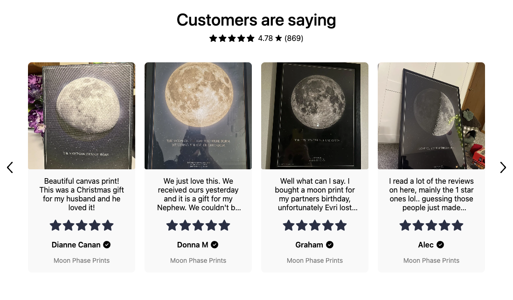

# Hydrogen example

This is the working reference storefront for [`judgeme-react`](../../packages/judgeme-react). It shows how the reverse-engineered Judge.me bridge fits into a current Shopify Hydrogen app without leaking server credentials or turning one flaky widget into a failed product page.

Use it as a comparison repo, not as an instruction to replace your storefront. The package itself has no Hydrogen dependency.

## What to copy

| File | What it demonstrates |
| --- | --- |
| [`app/lib/judgeme.server.ts`](app/lib/judgeme.server.ts) | Server-only discovery of the store's current Judge.me extension assets, with a safe legacy/native fallback |
| [`app/root.tsx`](app/root.tsx) | One `JudgeMeProvider` around the storefront |
| [`app/routes/products.$handle.tsx`](app/routes/products.$handle.tsx) | Shared server fetches, per-widget failure isolation, typed config, and nullable vertical composition |
| [`app/entry.server.tsx`](app/entry.server.tsx) | Complete tested Hydrogen CSP sources for Judge.me, Shopify extension assets, images, media, and video frames |
| [`.env.example`](.env.example) | Shopify Headless values, Judge.me public configuration, and optional server-only Admin values |

Server modules import from `judgeme-react/server`. Components import from `judgeme-react/react`. The split prevents an accidental server fetcher or secret-bearing helper from entering the browser bundle.

[Browse one element-level screenshot for every component](../../docs/WIDGET_GALLERY.md).

[](../../docs/WIDGET_GALLERY.md#cards-carousel)

## Before you run it

You need:

- Bun 1.3.14;
- a Shopify storefront published to the Headless channel;
- Judge.me installed on the same store;
- the Judge.me app embed enabled on a published Online Store theme;
- a Judge.me Public API Token;
- a public product URL on that theme for extension-asset discovery.

The Judge.me private token is not used. Do not add it to the app.

## Get the credentials

### Judge.me

In Judge.me Admin, open **Settings > Integrations > View API tokens** and copy the **Public API Token** plus the permanent `*.myshopify.com` domain.

```dotenv
JUDGEME_SHOP_DOMAIN=store.myshopify.com
JUDGEME_PUBLIC_TOKEN=your-public-widget-api-token
JUDGEME_STOREFRONT_URL=https://store.myshopify.com/products/published-product
JUDGEME_V3_ASSET_BASE_URL=
```

`JUDGEME_STOREFRONT_URL` points at a public theme page where the Judge.me app embed is enabled. The server inspects that page only to find the current `cdn.shopify.com/extensions/.../assets/` deployment; it does not scrape reviews from Liquid HTML.

`JUDGEME_V3_ASSET_BASE_URL` is an optional last-known-good fallback for a password-protected, rate-limited, or unavailable theme. Most storefronts should leave it blank and use automatic discovery.

The public token is intended for storefront Widget API reads. The private token must never enter loader data, React props, `JudgeMeProvider`, logs, fixtures, or committed files. Judge.me documents the tokens in its [API credential guide](https://judge.me/help/en/articles/8409180-using-judge-me-api).

### Shopify Headless

If the store does not already have a Headless storefront:

1. Install or open Shopify's **Headless** sales channel.
2. Open **Sales channels > Headless**.
3. Add a storefront or select the existing one.
4. Under **Manage API access**, copy the Storefront API values.
5. Copy the Customer Account API values if the storefront uses customer accounts.
6. Publish the required products to the Headless sales channel.

Map the channel values like this:

| Environment variable | Shopify value | Exposure |
| --- | --- | --- |
| `PUBLIC_STORE_DOMAIN` | Permanent `store.myshopify.com` domain | Public |
| `PUBLIC_CHECKOUT_DOMAIN` | Checkout/store domain | Public |
| `PUBLIC_STOREFRONT_ID` | Numeric Headless storefront ID | Public |
| `PUBLIC_STOREFRONT_API_TOKEN` | Storefront API public token | Public |
| `PRIVATE_STOREFRONT_API_TOKEN` | Storefront API private token | Server-only |
| `PUBLIC_CUSTOMER_ACCOUNT_API_CLIENT_ID` | Customer Account client ID | Public |
| `PUBLIC_CUSTOMER_ACCOUNT_API_URL` | Customer Account API URL | Public |
| `SESSION_SECRET` | New high-entropy session secret | Server-only |

Shopify's current flow is documented in [Bring your own headless stack](https://shopify.dev/docs/storefronts/headless/bring-your-own-stack/index) and [Manage the Headless channel](https://shopify.dev/docs/storefronts/headless/building-with-the-storefront-api/manage-headless-channels). A storefront linked to Shopify's Hydrogen channel can also use `shopify hydrogen env pull`.

### Optional Shopify Admin token

`SHOPIFY_ADMIN_ACCESS_TOKEN` is not the Headless private Storefront token, and it is not a Judge.me token. This example uses it only on the server for Trust Badge metafields and as an AI Reviews Summary fallback when Judge.me's shop metafield is not Storefront-visible.

```dotenv
SHOPIFY_ADMIN_ACCESS_TOKEN=
SHOPIFY_ADMIN_API_VERSION=2026-04
```

Leave it blank if you do not need those paths. If you do, follow Shopify's [Admin API token guide](https://shopify.dev/docs/apps/build/authentication-authorization/access-tokens/generate-app-access-tokens-admin), grant the least access the app needs, and inject the credential only into the server runtime. Never return it from a loader or put it in a `PUBLIC_*` variable.

Judge.me owns these metafield definitions, so an authenticated Admin token does not guarantee that every key is readable.

## Run it

From the monorepo root:

```sh
bun install
cp examples/hydrogen/.env.example examples/hydrogen/.env
bun run dev
```

The example is also self-contained once the published npm dependency is installed:

```sh
cd examples/hydrogen
bun install
cp .env.example .env
bun run dev
```

It has no `workspace:` imports or private workspace aliases.

## How the route is put together

The product loader starts with `fetchLegacyStorefrontWidgets`. That call shares Judge.me's large settings/CSS response across legacy widgets and gives each optional endpoint its own nullable slot.

The newer components then fetch only what they need. For example, the v3 Review Widget, Reviews Grid, and carousel adapters combine one page-specific tokenless response with the shared settings and current extension deployment. A malformed or disabled widget returns `null`; it does not reject the route.

`JudgeMeWidgetStyles` mounts the shared dashboard stylesheet once. Every legacy component in that batch uses `includeStyles={false}`. Keep the shared style mount even when the page prefers `ReviewWidgetV3`: Judge.me's current v3 CSS references the `JudgemeStar` font from that payload.

Normal components are stacked in `.product-widgets`. The product information is not sticky. `FloatingReviewsTab` and `PopupReviews` sit outside the stack because they are viewport overlays.

Production content is honest by default:

| State | Example behavior |
| --- | --- |
| New Review Widget returns valid data | Render `ReviewWidgetV3` |
| New Review Widget is disabled or unavailable | Fall back to `LegacyReviewWidget` |
| Q&A is disabled | Skip the Q&A request and component |
| AI summary metafield is absent | Render nothing; never invent a summary |
| Trust badge, verified counter, medals, UGC, or video feed is ineligible/empty | Keep that component unmounted |
| One optional request is malformed or unavailable | Hide that widget and keep the rest of the page |

## Settings: Judge.me-owned vs host-owned

Dashboard-level Judge.me values that appear in the public settings payload carry over automatically: labels, translations, colors, branding, feature flags, and legacy CSS.

Shopify theme-editor app-block settings belong to one Liquid block instance and are not available to a headless app. The route supplies their typed equivalents in objects such as `reviewsGridConfig`, `reviewWidgetV3Config`, and `reviewSnippetsConfig`. That includes review selection, product IDs, rows, columns, max width, card sizing, arrows, autoplay, transitions, per-instance colors, and empty-state choices.

## CSP

The consuming app owns Content Security Policy. The tested configuration is in [`app/entry.server.tsx`](app/entry.server.tsx). It:

- keeps `'self'` in `scriptSrc`;
- uses `workerSrc: ["'self'", "blob:"]` for Vite without adding `blob:` to `scriptSrc`;
- allows `cdn.shopify.com` in script, style, connect, font, and image directives;
- includes Judge.me API/CDN origins, both Judge.me imgix hosts, the legacy S3 badge host, Instagram media hosts, and Vimeo/YouTube media and frame hosts.

Merge those sources into the host's existing policy. Do not replace checkout, analytics, or storefront sources. CSP headers are document-scoped, so perform a full page reload after changing them; hot module replacement cannot update the policy on the current document.

## Verify it

From the monorepo root:

```sh
bun run test
bun run lint
bun run typecheck
bun run build
```

Compilation cannot prove that Judge.me's current deployment still behaves the same way. Reload a published product in Brave, inspect console/network errors, exercise an interaction such as Write a review or a carousel/lightbox, then navigate away and back once to test SPA cleanup.

For an agent-led integration into another storefront, use the [copy-paste setup prompt](../../packages/judgeme-react/SETUP_PROMPT.md). It asks for the store, desired widgets, feature activation, loading strategy, and optional Admin access before implementing the same architecture.
